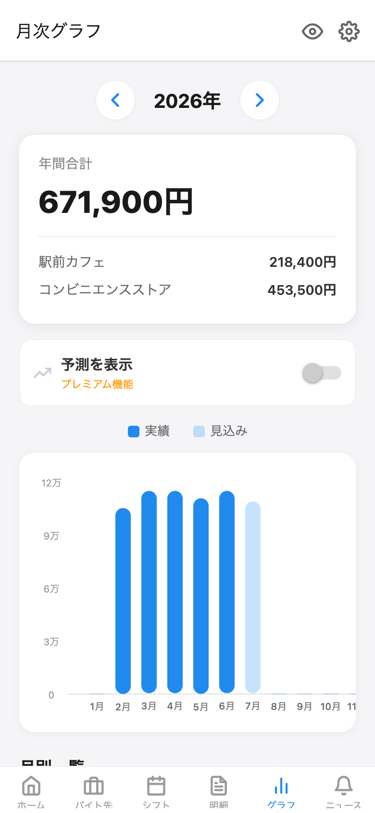

# バイト管理（baito-wallet）

**「扶養を守るための収入管理」に特化した、大学生・主婦層向けのアルバイト給与管理アプリ。**

掛け持ちバイトの収入をローカルで一元管理し、自分に適用される「扶養の壁」までの残り枠をリアルタイムで把握できます。2026年（令和8年分）税制改正（178万円の壁）に対応済み。

## スクリーンショット

| ホーム | シフト管理 | 給与明細 |
|:---:|:---:|:---:|
|  |  |  |
| 壁までの残り額・残り時間（時給換算）を表示 | 見込み給与を自動計算（交通費は非課税で分離） | 実支給額を課税/非課税で分けて記録 |

| バイト先 | 月次グラフ | 税制ニュース |
|:---:|:---:|:---:|
|  |  |  |
| 掛け持ちバイトを複数登録 | 実績/見込みを色分けした収入棒グラフ | 税制改正をアプリ内で周知 |

## 特徴

- **扶養壁の自動判定** — 生年月日・扶養種別・勤務先規模・学生かどうかの簡単な質問だけで、適用される壁（106万/130万/136万/150万/159万/169万/178万円）を自動判定。「どの壁を気にすべきか」をユーザーが調べる必要はありません
- **2026年税制改正対応** — 178万円の壁（令和8年分〜）、特定親族特別控除（159万円）、昼間学生の106万円壁適用除外まで反映。税制数値は2026年7月時点の法令に基づき検証済み
- **即日アップデートできる税制ルール** — 壁の金額・税制ニュースはリモートJSON（`public/tax_rules.json`）で管理。法改正時はJSONの差し替えだけで全ユーザーに反映（アプリ更新不要）。`disabled_walls` により壁の廃止（例: 2026年10月の106万円の壁撤廃）にも対応
- **完全ローカル保存** — 収入・個人情報はすべて端末内のSQLiteに保存。外部サーバーへの送信は一切ありません
- **実績×見込みのハイブリッド集計** — 給与明細の実績値を優先し、明細が未入力の月はシフトの見込み給与で補完。年収を常に最も確からしい値で把握
- **交通費の分離管理** — 非課税の交通費と課税対象の給与を分けて記録し、壁の判定を正確に

## 主な機能

| 機能 | 無料 | プレミアム |
|---|:---:|:---:|
| 扶養壁の自動判定・残り枠表示 | ✅ | ✅ |
| バイト先登録 | 2件まで | 無制限 |
| シフト入力・見込み給与計算 | 直近3ヶ月 | 全期間 |
| 給与明細入力 | ✅ | ✅（画像添付対応） |
| 月次グラフ（過去実績） | ✅ | ✅ |
| 収入予測グラフ・ペース警告 | — | ✅ |
| 税制ニュース | ✅ | ✅ |
| 確定申告サポート | ✅ | ✅ |
| プライバシーモード（金額を隠す） | ✅ | ✅ |

プレミアム: 月額200円 / 買い切り500円（RevenueCat経由）

## 技術スタック

- React Native + Expo（expo-router v6）
- TypeScript（strict）
- expo-sqlite（ローカルDB・マイグレーション管理）
- RevenueCat（react-native-purchases）
- Jest（`lib/tax.ts` は純粋関数としてテスト）

## セットアップ

```bash
npm install
npm start          # Expo起動（Expo Goで実機確認）
npm run start:mock # ダミーデータ入りで起動
npm run web        # ブラウザで起動
npm test           # ユニットテスト
```

課金機能（RevenueCat）はネイティブモジュールのため、Expo Goでは動作しません。動作確認にはEAS Development Buildを使用してください。

## 税制数値の管理

壁の金額はコードにハードコードせず、以下の2箇所で管理しています。

- `public/tax_rules.json` — 正式な値。GitHubのmainブランチから起動時にfetch
- `src/constants/walls.ts` — オフライン時のフォールバック値

税制変更時は両方を更新します。詳細な判定ロジック・仕様は [spec.md](spec.md) を参照してください。

## 免責事項

本アプリの計算はあくまで目安です。税制・社会保険制度は毎年変わるため、正確な判定は税理士・社会保険労務士等の専門家にご相談ください。
